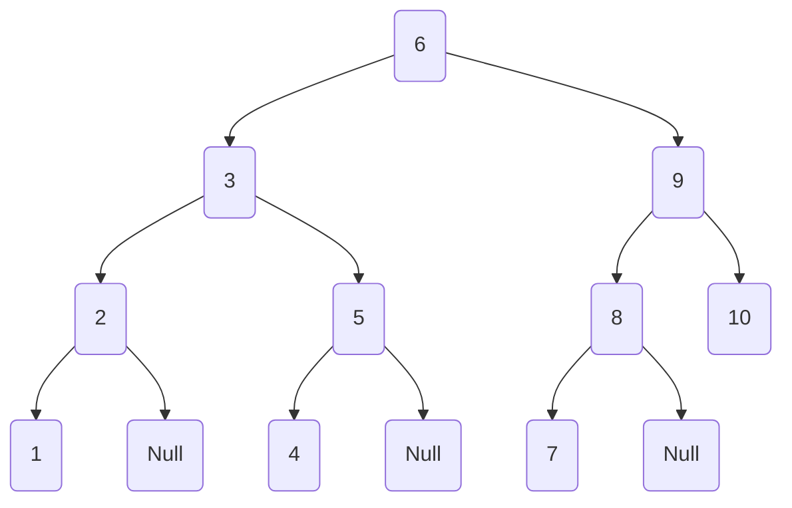

### 数组

这个树的构建，遵循的是go面试书里面的构建方式，构画树，是为了验证，先序，中序，层次遍历是否正确

- 数组

| 1    | 2    | 3    | 4    | 5    | 6    | 7    | 8    | 9    | 10   |
| ---- | ---- | ---- | ---- | ---- | ---- | ---- | ---- | ---- | ---- |

- 二分法切割，向右偏移，算出来的结果，也是层次遍历的结果

|        | 第一次切割 | 第二次切割 | 第三次切割 | 第四次切割 | 第五次切割 |
| ------ | ---------- | ---------- | ---------- | ---------- | ---------- |
| 第一层 | 6          |            |            |            |            |
| 第二层 | 3          | 9          |            |            |            |
| 第三层 | 2          | 5          | 8          | 10         |            |
| 第四层 | 1          | Null       | 4          | Null       | 7          |

- 树
  - 得到的树，1和4没有挂载2上，是书上的算法限制得到的结果

- 根据图得知

| 遍历     | 顺序       | 结果                          | 说明                                         |
| -------- | ---------- | ----------------------------- | -------------------------------------------- |
| 先序遍历 | 根，左，右 | 6，3，2，1，5，4，9，8，7，10 |                                              |
| 中序遍历 | 左，根，右 | 1，2，3，4，5，6，7，8，9，10 | 我们数组转树的时候，用的也是中序遍历的逆操作 |
| 后序遍历 | 左，由，根 | 1，2，4，5，3，7，8，10，9，6 |                                              |

